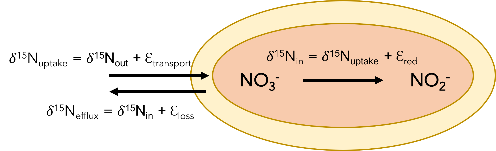

```{r "load packages", include=FALSE}
library(tidyverse)
```
## Simple nitrogen model

On tuesday we discussed the possible factors that control the isotopic fractionation observed in ecosystems. Let's start exploring these factors with a simple model of nitrate reduction. 

```{r out.width = "100%", echo=FALSE, eval=TRUE}

```

$$
\begin{aligned}
\delta{N_{in}} = \delta{N_{out}} + \epsilon_{t} - \epsilon_{red}f
\end{aligned}
$$

1) With this initial model, there is no reversibility involved, we are just looking at transport and reduction rates. How does f (reduction/transport) impact the $\delta N_{15}$ observed? Michaelis menton over the not michaelis menton. Look at board again...

```{r}
nin <- expand.grid(
 e_transport = 0.002,
 e_red = -0.025,
 del_nout = 0.005,
 f = seq(0.0, 1, 0.01)
) %>% 
  #as_data_frame() %>% 
  mutate(del_in = del_nout + e_transport - e_red*f)

plot <-
  ggplot(nin) +
  aes(x = f, y = del_in) +
  geom_line() +
  scale_x_continuous("f") +
  scale_y_continuous(name = latex2exp::TeX("$\\delta^{15}N_{in}$")) +
  scale_color_brewer(palette = "Dark2") +
  theme_bw()

plot
```

1) Why are delN15 values getting more positive? Does this make sense?

higher f implies faster reduction (relative to transport), less of this fractionation is seen inside the cell.  

## Effects of rates of uptake and reduction
```{r}
nin_mm <- expand.grid(
 e_transport = 0.002,
 e_red = -0.025,
 v_red = c(.1, .2),
 v_t = c(.1,.6),
 km_red = 5,
 km_t = 300,
 no3 = c(1,100,1),
 del_nout = 0.005
) %>% 
 # as_data_frame() %>% 
  mutate(
    f = ((v_red * no3) / (km_red + no3)) / ((v_t * no3) / (km_t + no3)),
    del_in = del_nout + e_transport - e_red*f
    )

plot <-
  ggplot(nin_mm) +
  aes(x = no3, y = del_in, color = factor(v_red), linetype = factor(v_t)) +
  geom_line() +
  scale_y_continuous(name = latex2exp::TeX("$\\delta^{15}N_{in}$")) +
  scale_color_brewer(palette="Dark2") +
  theme_bw()

plot
```

2.a) How do transport and nitrate reduction rates affect delN15?

2.b) Why does the delN15 decrease with increasing nitrate?  

Faster reduction rates, higher delN15 values. Opposite for transport because the smaller the number the larger the f value. What does it all mean?!! Faster transport rates are not useful because reduction has to keep up?? Higher nitrate concentrations result in lower delN15 because why? Something about the Km + no3 concentration. So higher concentrations translate into lower velocities because all the active sites are occupied?

Now let's look at a more complicated model that includes the reversibility step.

$$
\begin{aligned}
\delta{N_{in}} &= \delta{N_{out}} + (f - fr -1)\epsilon_{loss} + f(r - 1)(\epsilon_{red} + r\epsilon_{nir} - r\epsilon_{nix}) + \epsilon_t
\end{aligned}
$$

```{r}
# Nitrite reversibility model

nin_rev <- expand.grid(
 e_t = 0.002,
 e_red = -0.025,
 e_nix = 0.012,
 e_nir = -0.015,
 e_loss = 0.002,
 del_nout = 0.005,
 v_red = c(.1, .2),
 v_t = c(.1,.6),
 km_red = 5,
 km_t = 300,
 no3 = c(100),
 r = seq(0.1, 0.9, 0.1)
) %>% 

  as_data_frame() %>% 
  mutate(
    f = ((v_red * no3) / (km_red + no3)) / ((v_t * no3) / (km_t + no3)),
    del_in = del_nout + ((f - f*r - 1) * e_loss) + f*(r -1) * (e_red + (r * e_nir) - (r * e_nix)) + e_t
    )

plot <-
  ggplot(nin_rev) +
  aes(x = r, y = del_in, color = factor(v_red), linetype = factor(v_t)) +
  geom_line() +
  scale_x_continuous("r") +
  scale_y_continuous(name = latex2exp::TeX("$\\delta^{15}N_{in}$")) +
  scale_color_brewer(palette="Dark2") +
  theme_bw()

plot

```

Why does the shape of the plot change?

$$

\begin{aligned}
\delta_{O_{in}} =\ \frac{\epsilon_{loss}(fr\delta_{H2O} + 3\delta_{O_{out}}-3(1 + f(r-1)))}{3 + fr} + 3\epsilon_{t} + f((2r-3)\epsilon_{red} + r(2(r-1)\epsilon_{nir}-2(r-1)\epsilon_{nix}+\epsilon_{wi}+2\epsilon_{br.nar}))
\end{aligned}

$$


```{r}
# Full model with oxygen isotopes

nin_oxy <- expand.grid(
 e_t = 0.002,
 e_red = -0.025,
 e_br_nar = 0.025, #can be anywhere from 25-30
 e_nix = 0.003, #can be anywhere from 1.3-8.2 permil
 e_wi = -0.015, #range from -0.0128 to -0.0182
 e_nir = -0.012, #range from -0.005 to -0.025 need to find for oxygen
 e_loss = 0.002,
 del_oout = 0.0015, #is this also zero?
 del_h2o = 0.00, 
 v_red = c(.1, .2),
 v_t = c(.1,.6),
 km_red = 5,
 km_t = 300,
 no3 = c(100),
 r = seq(0.1, 1, 0.1)
) %>% 
  as_data_frame() %>% 
  mutate(
    f = ((v_red * no3) / (km_red + no3)) / ((v_t * no3) / (km_t + no3)), 
    del_in = (e_loss*(f*r*del_h2o + 3*del_oout - 3*(1 + f*(r-1)))) / (3 + f*r) + 3*e_t + f*(2*r - 3) * e_red + r*(2*(r -1 )*e_nir - 2*(r - 1) * e_nix + e_wi + 2*e_br_nar)
  )

oxy_plot <- 
  ggplot(nin_oxy) +
  aes(x = r, y = del_in, color = factor(v_red), linetype = factor(v_t)) +
  geom_line() +
  scale_color_brewer(palette = "Dark2") +
  theme_bw()
  
oxy_plot
  
```