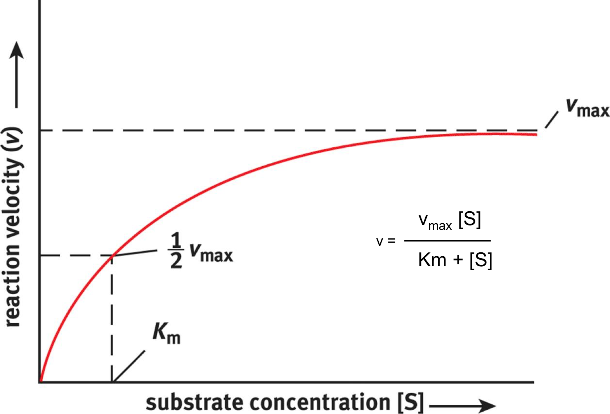
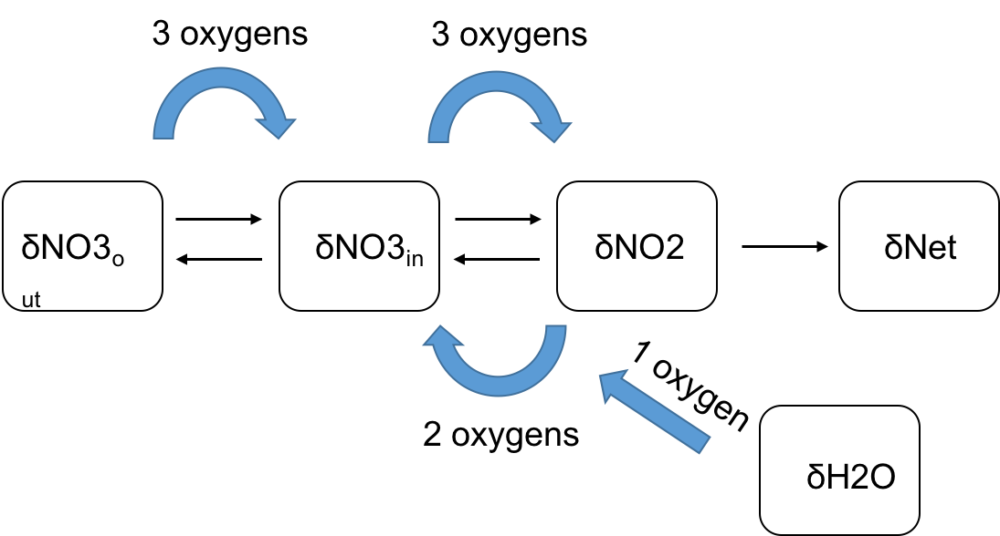

```{r "load packages", include=FALSE}
library(tidyverse)
```
## Simple nitrogen model

On tuesday we discussed the possible factors that control the isotopic fractionation observed in ecosystems. Let's start exploring these factors with a simple model of nitrate reduction. 

```{r out.width = "100%", echo=FALSE, eval=TRUE}
knitr::include_graphics("iso_model.png")
```

The calculations for $\delta N_{in}$ and $\delta N_{2}$ are as follows.

$$
\begin{aligned}
\delta{N_{in}} = \delta{N_{out}} + \epsilon_{t} - \epsilon_{red}f \\
\delta_{N_2} = \delta_{NO3.out} + (-1 + f)(\epsilon_{loss} - \epsilon_{nar}) + \epsilon_{tr}
\end{aligned}
$$

1) With this initial model, there is no reversibility involved, we are just looking at transport and reduction rates which are captured with the f parameter. Calculate del_in.

```{r}
nin <- expand.grid(
 e_transport = -0.002,
 e_red = -0.025,
 del_nout = 0.005,
 f = seq(0.0, 1, 0.01)
) %>% 
  mutate(
    del_in = del_nout + e_transport - e_red*f,
    del_n2 = del_nout + (-1+f) * (e_transport - e_red) + e_transport
  ) #%>% 
 #gather(key = variable, value = delta, starts_with("del"))

plot <-
  ggplot(nin) +
  aes(x = f, y = del_in) +
  geom_line() +
  scale_x_continuous("f") +
  scale_y_continuous(name = latex2exp::TeX("$\\delta^{15}N_{in}$")) +
  scale_color_brewer(palette = "Dark2") +
  theme_bw()

plot
```

1.a) How does f (reduction/transport) impact the $\delta N_{15}$ observed? 


1.b) Why are delN15 values getting more positive? Does this make sense?


1.c) Un-hash lines 49 and 50. Try plotting with f on the x-axis, delta on the y, and color by variable. What does this show us?


## Effects of rates of uptake and reduction

So far our f is somewhat arbitrary. To make this a more realistic model, we can add enzyme rates of reaction into our equations. The michaelis-menten reaction looks like this:

```{r out.width = "100%", echo=FALSE, eval=TRUE}

```

This equation takes into account the amount of substrate, rates of reaction (vmax) for catalyzed by the enzymes, and the enzyme half saturation constant (Km). Complete the calculation for f using the michaelis menten equation to investigate the enzyme dynamics in this system. 

```{r}
nin_mm <- expand.grid(
 e_transport = -0.002,
 e_red = -0.025,
 v_red = c(.01, .02),
 v_t = c(1,6),
 km_red = 5,
 km_t = 300,
 no3 = seq(1,300,1),
 del_nout = 0.005
) %>% 
  
  mutate(
    f = ((v_red * no3) / (km_red + no3)) / ((v_t * no3) / (km_t + no3)),
    del_in = del_nout + e_transport - e_red*f,
    del_n2 = del_nout + (-1+f) * (e_transport - e_red) + e_transport
  ) %>% 
 gather(key = variable, value = delta, starts_with("del"))

plot_f <- 
     ggplot(nin_mm) +
     aes(x= no3, y= f, color = factor(v_red), linetype = factor(v_t)) +
     geom_line() +
     theme_bw() +
     scale_color_brewer(palette="Dark2")
   
plot_f
```
2.a)  How do transport and nitrate reduction affect f? 


We can also calculate the $\delta N_{2}$ for outside of the cell. This represents the nitrate that has been reduced all of the way into N2 gas.
```{r}
nin_mm <- expand.grid(
 e_transport = -0.002,
 e_red = -0.025,
 v_red = c(.01, .02),
 v_t = c(1,6),
 km_red = 5,
 km_t = 300,
 no3 = seq(1,300,1),
 del_nout = 0.005
) %>% 
 # as_data_frame() %>% 
  mutate(
    f = ((v_red * no3) / (km_red + no3)) / ((v_t * no3) / (km_t + no3)),
    del_in = del_nout + e_transport - e_red*f,
    del_n2 = del_nout + (-1+f) * (e_transport - e_red) + e_transport
  ) %>% 
 gather(key = variable, value = delta, starts_with("del"))

plot <-
  ggplot(nin_mm) +
  aes(x =no3, y = delta, color = factor(v_red), linetype = factor(v_t)) +
  geom_line() +
  facet_wrap(~variable) +
  scale_y_continuous(name = latex2exp::TeX("$\\delta^{15}N_$")) +
  scale_x_continuous("[NO3]") +
  scale_color_brewer(palette="Dark2") +
  theme_bw()

plot
```
2.b) Explain the relationship between $\delta N_{in}$ and $\delta N_2$.


##Nitrite reductase reversibility
Now let's look at a more complicated model that includes a reversibility step. The nitrite reductase enzyme (nir) can be reversible under some environmental conditions, such as low pH, and can oxidize nitrite back into nitrate. Here is the isotopic mass balance under these conditions:

$$
\begin{aligned}
\delta{N_{in}} &= \delta{N_{out}} + (f - fr -1)\epsilon_{loss} + f(r - 1)(\epsilon_{red} + r\epsilon_{nir} - r\epsilon_{nix}) + \epsilon_t
\end{aligned}
$$
Vary the rates of reduction (between 0.1 and 0.9) and transport (betwen 1 and 15).

```{r}

nin_rev <- expand.grid(
 e_t = -0.002,
 e_red = -0.025,
 e_nix = 0.012,
 e_nir = -0.015,
 e_loss = -0.002,
 del_nout = 0.005,
 v_red = c(.1, .2),
 v_t = c(.1,.6),
 km_red = 5,
 km_t = 300,
 no3 = 100,
 r = seq(0, 1,.1)
) %>% 

  as_data_frame() %>% 
  mutate(
    f = ((v_red * no3) / (km_red + no3)) / ((v_t * no3) / (km_t + no3)),
    del_in = del_nout + ((f - f*r - 1) * e_loss) + f*(r -1) * (e_red + (r * e_nir) - (r * e_nix)) + e_t
    )

plot <-
  ggplot(nin_rev) +
  aes(x = r, y = del_in, color = factor(v_red), linetype = factor(v_t)) +
  geom_line() +
  #scale_x_continuous("nitrite reductase reversibility") +
  scale_y_continuous(name = latex2exp::TeX("$\\delta^{15}N_{in}$")) +
  scale_color_brewer(palette="Dark2") +
  theme_bw()

plot

```

We can also plot this to look how f influences this response. Vary f from 0 to 1:
```{r}
nin_rev <- expand.grid(
 e_t = -0.002,
 e_red = -0.025,
 e_nix = 0.012,
 e_nir = -0.015,
 e_loss = -0.002,
 del_nout = 0.005,
 v_red = c(0.02,0.08),
 v_t = c(1,10),
 km_red = 5,
 km_t = 300,
 no3 = 100,
 r = seq(0, 1,.1),
 f = seq(0,1,.25)
) %>% 

  as_data_frame() %>% 
  mutate(
    #f = ((v_red * no3) / (km_red + no3)) / ((v_t * no3) / (km_t + no3)),
    del_in = del_nout + ((f - f*r - 1) * e_loss) + f*(r -1) * (e_red + (r * e_nir) - (r * e_nix)) + e_t,
    del_n2 = del_nout + (1+f*(r-1)) * (e_red - e_loss +r*(e_nir) - r * (e_nix)) + e_t #delta n2 including reversibility
    ) %>% 
  gather(key = variable, value = delta, starts_with("del"))

plot <-
  ggplot(nin_rev) +
  aes(x = r, y = delta * 1000, color = factor(round(f,3))) +
  geom_line() +
  #scale_x_continuous("nitrite reductase reversibility") +
  scale_y_continuous(name = latex2exp::TeX("$\\delta^{15}N_$")) +
  facet_wrap(~variable) +
  scale_color_brewer(palette="Dark2") +
  theme_bw()

plot
```

3.a) How does reversibility affect the $\delta N_{in}$ and $\delta N_{2}$? Does this make sense?


3.b) Why do the lines all converge on a single point?


 
##Oxygen isotopes

Now let's look at the oxygen isotopes. Stoichiometry is wild! 

```{r out.width = "100%", echo=FALSE, eval=TRUE}

```

$$

\begin{aligned}
\delta_{O_{in}} =\ \frac{\epsilon_{loss}(fr\delta_{H2O} + 3\delta_{O_{out}}-3(1 + f(r-1)))}{3 + fr} + 3\epsilon_{t} + f((2r-3)\epsilon_{red} + r(2(r-1)\epsilon_{nir}-2(r-1)\epsilon_{nix}+\epsilon_{wi}+2\epsilon_{br.nar}))
\end{aligned}

$$

Vary the reversibility and transport rate (best to do with two values at a time, try things between 1 and 20.) to determine the oxygen isotope dynamics. 

```{r}

nin_oxy <- expand.grid(
 e_t = -0.002,
 e_red = -0.025,
 e_br_nar = 0.025, #can be anywhere from 25-30
 e_nix_o = 0.003, #can be anywhere from 1.3-8.2 permil
 e_wi = -0.015, #range from -0.0128 to -0.0182
 e_nir_o = -0.012, #range from need to find for oxygen or is it just the same?
 e_loss = -0.002,
 del_oout = 0.0015, 
 del_h2o = 0.00, 
 v_red = c(.1, .2),
 v_t = c(3,15),
 km_red = 5,
 km_t = 300,
 no3 = 100,
 r = seq(0, 1, 0.1)
) %>% 
  as_data_frame() %>% 
  mutate(
    f_o = ((v_red * no3) / (km_red + no3)) / ((v_t * no3) / (km_t + no3)), 
    del_in_o = (e_loss*(f_o*r*del_h2o + 3*del_oout - 3*(1 + f_o*(r-1)))) / (3 + f_o*r) + 3*e_t + f_o*(2*r - 3) * e_red + r*(2*(r -1 )*e_nir_o - 2*(r - 1) * e_nix_o + e_wi + 2*e_br_nar)
  )

oxy_plot <- 
  ggplot(nin_oxy) +
  aes(x = r, y = del_in_o, color = factor(v_red), linetype = factor(v_t)) +
  geom_line() +
  scale_color_brewer(palette = "Dark2") +
  scale_y_continuous(name = latex2exp::TeX("$\\delta^{18}O_{in}$")) +
  scale_x_continuous("nitrite reductase reversibility") +
  theme_bw()
  
oxy_plot
  
```
4a. Does this plot make sense? What about in relation to the nitrogen isotopes?


##Combo-topes

For reasons somewhat unknown oxygen and nitrogen isotopes fractionate at a 1:1 ratio during nitrate reduction. Let's see how this trend holds up under different reversibilities. Create a new df that combines the last two dfs that we have worked with. 

```{r}
new_df<- left_join(nin_oxy, nin_rev)

on <- ggplot(new_df) +
  aes(x = del_in_o, y=del_in, color = factor(r)) +
  geom_line() +
  scale_x_continuous(name = latex2exp::TeX("$\\delta^{18}O_{in}$")) +
  scale_y_continuous(name = latex2exp::TeX("$\\delta^{15}N_{in}$")) +
  theme_bw()

on
```

5.a) What does this mean about the relationship between oxygen and nitrogen isotopes? 


